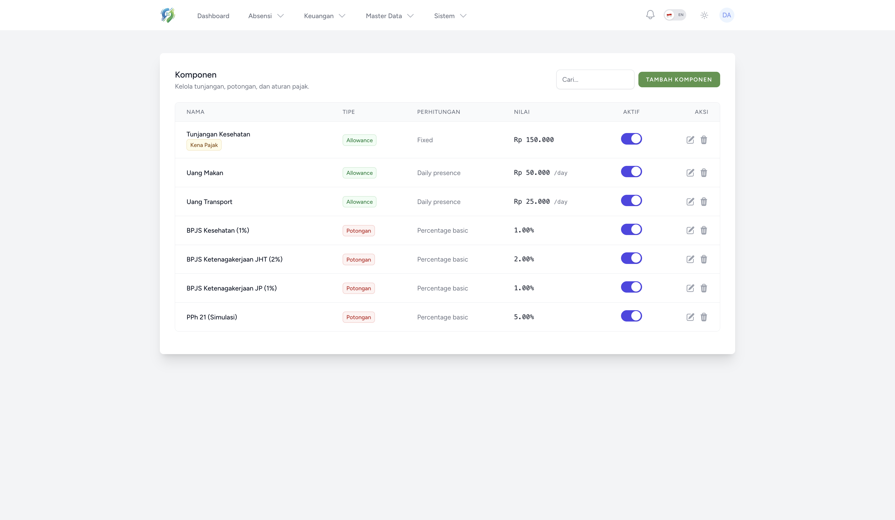
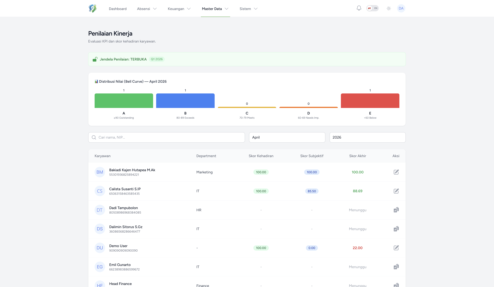
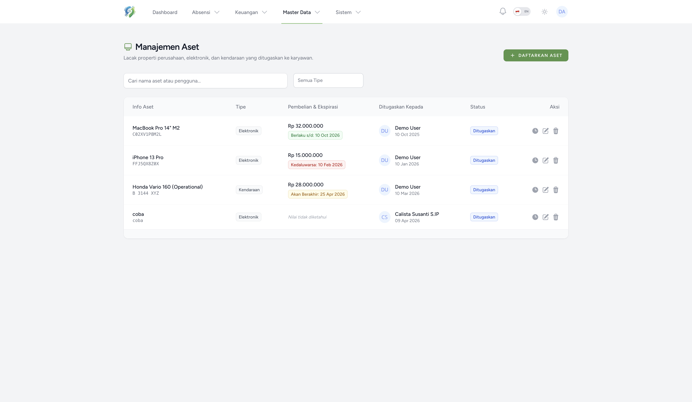
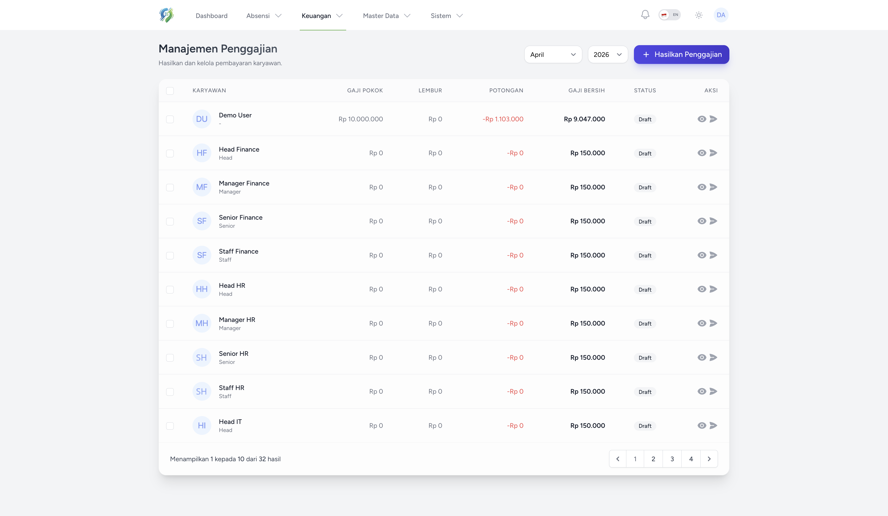
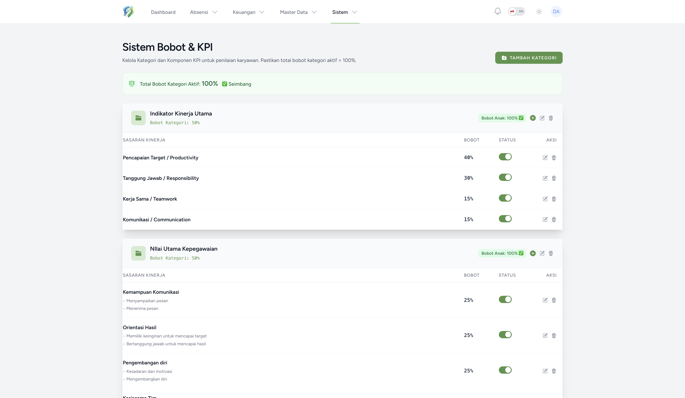
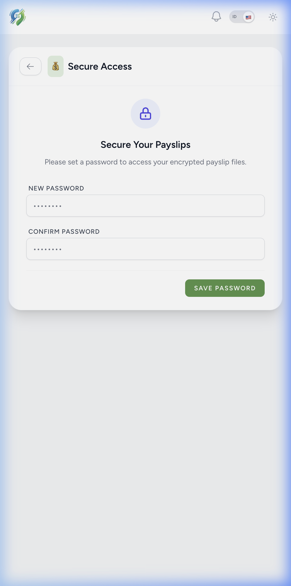
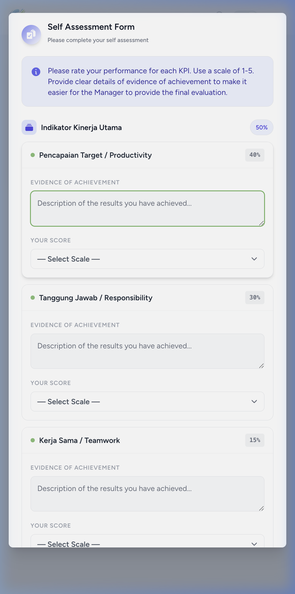
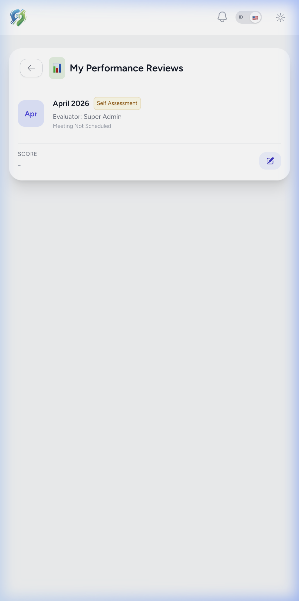
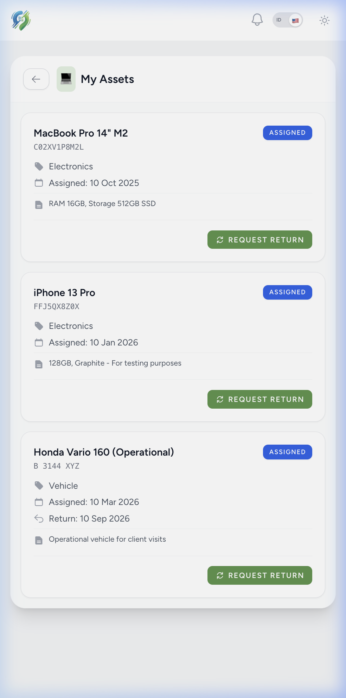
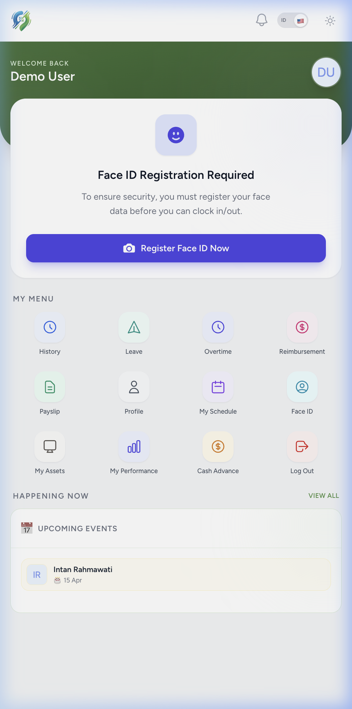

<div align="center">


# **PasPapan** — Enterprise Workforce Management
**Solusi Terpadu Geofencing, Verifikasi Biometrik & Manajemen Payroll Indonesia.**

[-Red?style=flat-square&logo=google-translate)](./README.md) 
[](https://laravel.com)
[](https://livewire.laravel.com)
[](https://tailwindcss.com)

[Demo Langsung](#kredensial-demo) • [Instalasi](#instalasi-servervps) • [Fitur Utama](#fitur-unggulan)

</div>

---

## 🎯 Solusi Final HR & Payroll Anda
Stop budaya titip absen (buddy punching), blokir pengguna lokasi palsu (Fake GPS), dan otomatisasi perhitungan Payroll. **PasPapan** menjembatani celah antara pengawasan fisik karyawan dan fleksibilitas kerja jarak jauh (remote/hybrid).

## 🌟 <a id="fitur-unggulan"></a>Fitur Unggulan

### 🛡️ Keamanan Berlapis Tingkat Tinggi
* **Smart Geofencing** & **Anti-Fake GPS**: Radius penguncian tingkat presisi yang mendeteksi dan menolak aplikasi Mock Location.
* **Verifikasi Face ID**: Pengenalan wajah berbasis AI yang secara otomatis mencocokkan wajah karyawan untuk memblokir penipuan.
* **Device Identity Lock**: Fitur penguncian akses akun karyawan hanya untuk perangkat atau HP yang sudah tervalidasi.

### 📈 Penilaian Kinerja Kelas Enterprise (V2)
* **Hierarki KPI Karyawan**: Modul pendaftaran dan pemetaan KPI berbobot (Induk & Komponen Anak) untuk penilaian berbasis hasil.
* **Alur Kalibrasi Dinamis**: Penjadwalan cerdas sesi 1-on-1, penilaian subjektif atasan langsung, dan laporan tanda tangan digital Direktur.
* **Grafik Distribusi Skor**: Rekapitulasi kurva lonceng (Bell-curve) untuk membantu HR menyortir bias subjektivitas dalam pengisian nilai.

### 💰 Payroll Indonesia Otomatis (TER)
* **Satu-Klik Payroll**: Multi-pendekatan perhitungan gaji entah menggunakan Angka Tetap, Hitungan Harian, atau variabel Persentase Gaji Pokok.
* **Standardisasi BPJS & Pajak**: Injeksi otomatis BPJS Kesehatan, Ketenagakerjaan (JHT/JP), dan regulasi Pajak PPh 21 (TER Terbaru).
* **Integrasi Kasbon**: Lifecycle peminjaman karyawan yang terautomasi dan langsung mengikat sebagai potongan pada kalender penggajian.
* **E-Payslip Terenkripsi**: Slip gaji PDF terlindungi password pribadi—karyawan harus mengatur kode akses sendiri sebelum bisa membuka data gaji mereka.

### 🏢 Skalabilitas Eksekutif
* **Manajemen Siklus Aset**: Pemantauan langsung inventaris perusahaan (MacBook, Mobil Box, dll) mencakup 8 status serah-terima karyawan.
* **Otonomi Admin Regional**: Akses perwakilan multi-cabang (Role) yang diisolasi ketat sesuai yurisdiksi provinsi/kota tanpa bercampur ruang data pusat.
* **Approval Struktural**: Alur persetujuan Cuti dan Reimbursement secara paralel yang harus bergerak dari Head divisi menuju divisi Keuangan.

---

## 📸 Tampilan Aplikasi

<details>
<summary><b>💻 Admin Dashboard (Web)</b></summary>
<br>

| Administrasi | Operasional |
| :---: | :---: |
|  <br> **Dashboard** |  <br> **Data Absensi** |
|  <br> **Persetujuan Cuti** |  <br> **Lembur** |
|  <br> **Manajemen Shift** |  <br> **Analitik** |
|  <br> **Libur Kalender** |  <br> **Pengumuman** |
|  <br> **Sistem Payroll** |  <br> **Reimbursement** |
|  <br> **Tunjangan** |  <br> **Cetak QR Code** |
|  <br> **Pengaturan Sistem** |  <br> **Pemeliharaan** |
|  <br> **Export/Import Pegawai** |  <br> **Export/Import Absensi** |

**🆕 Fitur Enterprise V2**

| Modul Enterprise | Modul Enterprise |
| :---: | :---: |
|  <br> **Komponen Payroll** |  <br> **Penilaian Kinerja** |
|  <br> **Manajemen Aset** |  <br> **Penggajian** |
|  <br> **Sistem Bobot & KPI** | |

</details>

<details>
<summary><b>📱 Mobile Interface (Employee)</b></summary>
<br>

| 📱 | 📱 | 📱 | 📱 |
| :---: | :---: | :---: | :---: |
| <br>Login | <br>Setup Face ID | <br>Beranda | <br>Riwayat Log |
| <br>Pengajuan Cuti | <br>Form Lembur | <br>Reimbursement | <br>Slip Gaji Digital |
| <br>Profil User | <br>Jadwal Kerja | <br>Scan Wajah | <br>Scan QR |
| <br>Peringatan QR | <br>Selfie Lokasi | <br>Berhasil Pulang | <br>Selesai Shift |
| <br>Payslip Terkunci | <br>Penilaian KPI | <br>Review Kinerja | <br>Lacak Aset |
| <br>Pendaftaran Wajah | | |

</details>

---

## 🚀 <a id="instalasi-servervps"></a>Instalasi (Server/VPS)

Proses _Deployment_ PasPapan ke lingkungan VPS Linux maupun Shared Hosting berbasis cPanel sangatlah efisien.

#### 1. Persiapan Lingkungan
```bash
git clone https://github.com/RiprLutuk/PasPapan.git
cd PasPapan

composer install --optimize-autoloader --no-dev
bun install
cp .env.example .env
nano .env # Set detail Database Anda beserta APP_ENV=production
```

#### 2. Build & Optimasi
```bash
bun run build
php artisan key:generate
php artisan migrate --seed --force
php artisan storage:link

php artisan optimize
```

#### 3. Hak Akses File (Server Linux)
```bash
sudo chown -R www-data:www-data storage bootstrap/cache
sudo chmod -R 775 storage bootstrap/cache
```

### 🔄 Modul Auto-Updater
Perbarui versi PasPapan live server Anda tanpa gangguan/downtime hanya dengan 1 baris skrip:
```bash
bash update.sh
```

---

## 🧪 <a id="kredensial-demo"></a>Kredensial Demo
Rasakan uji kekuatan dan kelembutan flow UI produk pada kotak pasir terbatas.

**Akses Web:** [paspapan.pandanteknik.com](https://paspapan.pandanteknik.com)

| Peran Role | Login Email | Sandi / Password |
| :--- | :--- | :--- |
| **Admin** | `admin123@paspapan.com` | `12345678` |
| **User** | `user123@paspapan.com` | `12345678` |

---

## 🤝 Kredit & Pengembang

Awal sistem open source ini menggunakan inti core dasar yang sangat brilian oleh [Ikhsan3adi](https://github.com/ikhsan3adi). Kemudian didesain, dire-arsitektur ulang total agar bisa berskala untuk level Enterprise oleh **[RiprLutuk](https://github.com/RiprLutuk)**.

  <b>Bantu Kopi Developer</b><br>
  
  <p style="margin-top: 15px; font-weight: bold; font-size: 1.1em; color: #00AEDA; letter-spacing: 1px;">💳 GOPAY SUPPORT</p>
