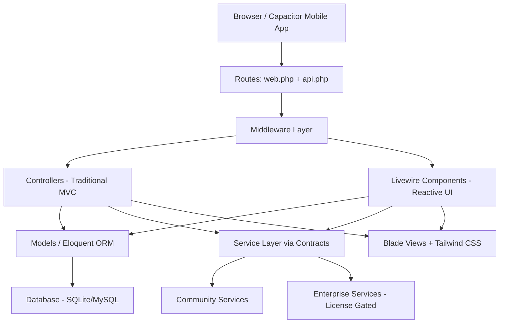
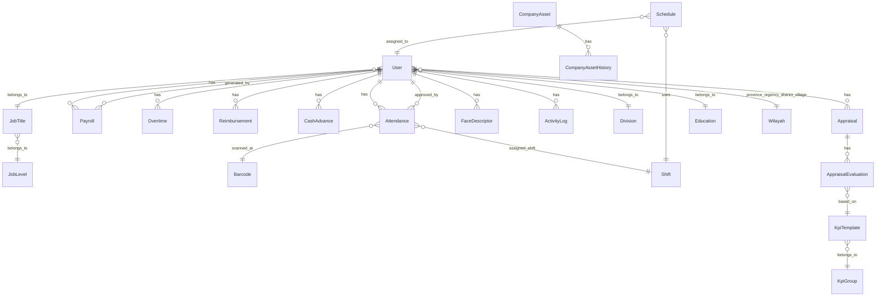

# PasPapan HRIS — Project Analysis

## 1. Project Overview

**PasPapan** is an Enterprise Workforce Management / HRIS (Human Resource Information System) platform built with **Laravel 11**, **Livewire 3**, and **Tailwind CSS 3.4**. It provides geofencing-based attendance, biometric face verification, payroll processing with Indonesian tax compliance, and performance appraisals.

- **Version**: 1.7.0 (per `package.json`)
- **Product Name**: PasPapan
- **License Model**: Open-Core (Community + Enterprise tiers)
- **Live Demo**: [paspapan.pandanteknik.com](https://paspapan.pandanteknik.com)
- **Origin**: Re-architected from an open-source foundation by [Ikhsan3adi](https://github.com/ikhsan3adi), transformed into an enterprise system by [RiprLutuk](https://github.com/RiprLutuk).

---

## 2. Technology Stack

| Layer | Technology |
|---|---|
| **Backend Framework** | Laravel 11.x (PHP 8.2+) |
| **Frontend Reactivity** | Livewire 3 (full-page + inline components) |
| **CSS Framework** | Tailwind CSS 3.4 with `@tailwindcss/forms` and `@tailwindcss/typography` |
| **Auth & Session** | Laravel Jetstream 5.1 + Fortify (2FA support) |
| **API Auth** | Laravel Sanctum 4.0 |
| **Build Tool** | Vite 7.3 via `laravel-vite-plugin` |
| **Package Manager** | Bun (frontend), Composer (backend) |
| **Mobile Wrapper** | Capacitor 8.1 (Android target with camera, geolocation, barcode scanner) |
| **PDF Generation** | barryvdh/laravel-dompdf 3.1 |
| **Excel Import/Export** | maatwebsite/excel 3.1 |
| **QR Code** | endroid/qr-code 5.0 |
| **Image Processing** | intervention/image 3.6 |
| **Icons** | blade-heroicons 2.3 |
| **Testing** | Pest 2.0 + Pest Laravel Plugin |
| **Linting** | Laravel Pint |
| **Localization** | Bilingual EN/ID (`lang/en.json`, `lang/id.json`, `lang/id/*.php`) |
| **Database** | SQLite (default dev) / MySQL (production) |

---

## 3. Architecture Overview

### 3.1 Open-Core Service Architecture

The project uses a **Contract → Community/Enterprise Service** pattern, bound via the `AppServiceProvider`:

```
App\Contracts\*Interface
    ├── Community*Service  (free, always available)
    └── Enterprise*Service (requires valid license via LicenseGuard)
```

**Four service domains** follow this pattern:

| Contract | Community Service | Enterprise Service |
|---|---|---|
| `AttendanceServiceInterface` | `Attendance\CommunityService` | `Attendance\EnterpriseService` |
| `PayrollServiceInterface` | `Payroll\CommunityPayrollService` | `Payroll\EnterprisePayrollService` |
| `ReportingServiceInterface` | `Reporting\CommunityReportingService` | `Reporting\EnterpriseReportingService` |
| `AuditServiceInterface` | `Audit\CommunityAuditService` | `Audit\EnterpriseAuditService` |

The `Editions` helper class provides feature-lock checks (e.g., `payrollLocked()`, `appraisalLocked()`). Currently all return `false` (unlocked for development).

The `LicenseGuard` service is **obfuscated** (`eval(gzinflate(base64_decode(...)))`) — this is the enterprise license validation mechanism.

### 3.2 Application Layers



### 3.3 User Role System

Roles are stored as a `group` column on the `users` table (not a separate roles/permissions table):

| Group | Access Level |
|---|---|
| `user` | Employee portal — attendance, leave, overtime, payslips, assets, performance |
| `admin` | Admin panel — manage employees, attendance, payroll, settings |
| `superadmin` | Full access — all admin features + system maintenance + unrestricted scopes |

Middleware enforcement:
- `AdminMiddleware` — checks `Auth::user()->isAdmin` (includes superadmin)
- `UserMiddleware` — restricts to employee-only routes
- Additional middleware: `CheckMaintenanceMode`, `EnsureSecurityHeaders`, `LogUserActivity`, `SetLocale`, `SetUserLocale`, `ThrottleRequestsByIP`

### 3.4 Supervisor/Subordinate Hierarchy

The `User` model implements a **rank-based hierarchy** via `JobTitle → JobLevel`:
- `getSupervisorAttribute()` — finds the closest higher-ranked user in the same division
- `getSubordinatesAttribute()` — finds all lower-ranked users in the same division
- Lower `rank` number = higher seniority (1 = Head, 4 = Staff)

---

## 4. Domain Model (26 Eloquent Models)



### Key Models:

| Model | Purpose |
|---|---|
| `User` | Employee/Admin with ULIDs, profile photo, salary, payslip password |
| `Attendance` | Check-in/out with GPS coords, accuracy, photos, approval workflow |
| `Payroll` | Monthly salary calculation with allowances, deductions, overtime, net salary |
| `PayrollComponent` | Configurable payroll line items |
| `Overtime` | Overtime request and approval tracking |
| `Reimbursement` | Expense reimbursement requests |
| `CashAdvance` | Kasbon (loan) lifecycle management |
| `Appraisal` | Performance review with evaluator, calibrator, MBO columns |
| `AppraisalEvaluation` | Individual KPI scores within an appraisal |
| `KpiTemplate` / `KpiGroup` | KPI definition hierarchy |
| `CompanyAsset` / `CompanyAssetHistory` | Asset lifecycle tracking |
| `Barcode` | QR code locations for attendance scanning |
| `Shift` / `Schedule` | Work shift definitions and employee scheduling |
| `Holiday` / `Announcement` | Company calendar and announcements |
| `Setting` | Key-value app configuration with caching |
| `FaceDescriptor` | Biometric face data for verification |
| `ActivityLog` | Security audit trail |
| `Wilayah` | Indonesian administrative regions (provinces, regencies, districts, villages) |

---

## 5. Feature Modules

### 5.1 Employee (User) Features
- **Attendance**: QR scan, GPS geofencing, face ID verification, selfie photo, check-in/check-out
- **Leave Requests**: Apply with attachments, approval workflow
- **Overtime Requests**: Submit and track overtime
- **Reimbursements**: Expense claim submission
- **Cash Advances (Kasbon)**: Loan requests with payroll deduction integration
- **Payslips**: Password-protected PDF payslip viewing
- **My Assets**: View assigned company assets
- **My Performance**: View KPI appraisals and scores
- **Face Enrollment**: Register biometric face data
- **Shift Schedule**: View personal work schedule
- **Notifications**: In-app notification center
- **Team Approvals**: Supervisors approve subordinate requests

### 5.2 Admin Features
- **Dashboard**: Real-time attendance stats, charts (week/month), pending counts
- **Employee Management**: CRUD with import/export (Excel)
- **Attendance Management**: View, filter, report generation, PDF export
- **Leave Approval**: Approve/reject leave requests
- **Overtime Management**: Manage overtime requests
- **Payroll**: Bulk generation, component configuration, payslip management
- **Reimbursement Management**: Review and approve expenses
- **Asset Management**: 8-phase lifecycle tracking
- **Appraisal Management**: KPI setup, evaluation, calibration workflows
- **Holiday Calendar**: Manage holidays (with auto-fetch national holidays command)
- **Announcements**: Company-wide announcements with dismissal tracking
- **Barcode/QR Management**: Create and print QR codes for locations
- **Master Data**: Divisions, Job Titles, Education levels, Shifts, Admin users
- **Schedules**: Assign shifts to employees
- **Analytics Dashboard**: Workforce analytics
- **Activity Logs**: Security audit trail with export
- **Import/Export**: Bulk user and attendance data operations
- **Settings**: App configuration, KPI settings, payroll settings
- **System Maintenance**: Maintenance mode toggle

### 5.3 API Endpoints
- **Wilayah**: Indonesian region data (provinces → villages)
- **Capacitor Device**: Location, barcode, photo upload, permissions (for mobile app)

---

## 6. Livewire Component Inventory (50+ components)

### User-facing (21 components):
`AnnouncementWidget`, `AttendanceHistoryComponent`, `AttendanceSummaryWidget`, `BirthdayWidget`, `CalendarPage`, `FaceEnrollment`, `HomeAttendanceStatus`, `MyAssets`, `MyPayslips`, `MyPerformance`, `NotificationsDropdown`, `NotificationsPage`, `OvertimeRequest`, `PayrollManager`, `QuickActions`, `ReimbursementPage`, `ScanComponent`, `ShiftSchedulePage`, `TeamApprovals`, `TeamApprovalsHistory`, `UpcomingEventsWidget`

### Admin (20+ components):
`ActivityLogs`, `AnalyticsDashboard`, `AnnouncementManager`, `AppraisalManager`, `AssetManager`, `AttendanceComponent`, `BarcodeComponent`, `BarcodeValueInputComponent`, `DashboardComponent`, `EmployeeComponent`, `HolidayManager`, `LeaveApproval`, `OvertimeManager`, `PayrollSettings`, `ReimbursementManager`, `ScheduleComponent`, `Settings`, `SystemMaintenance`, `ImportExport/Attendance`, `ImportExport/User`, `MasterData/*` (5 components), `Settings/KpiSettings`

### Finance (2 components):
`CashAdvanceManager`, `MyCashAdvances`

### Shared:
`Forms/ShiftForm`, `Forms/UserForm`, `Traits/AttendanceDetailTrait`

---

## 7. Database Schema (57 migrations)

The migration history shows the evolution from a basic attendance system to a full enterprise HRIS:

1. **Foundation** (2024): Users, divisions, education, job titles, barcodes, shifts, attendances, personal access tokens
2. **Geolocation & Photos** (2024-12): Geolocation logs, attendance photos, location history
3. **Enterprise Core** (2026-01): Activity logs, schedules, settings, language support, approval workflows, notifications, performance indexes, announcements, holidays, reimbursements, job levels, overtimes, payrolls, payroll components, face descriptors, enterprise license, GPS accuracy
4. **Finance** (2026-03): Cash advances, Wilayah (Indonesian regions), double approval for finance
5. **Assets & Appraisals** (2026-04): Company assets, appraisals, asset histories, KPI groups, MBO columns, calibration workflows

---

## 8. Security Features

- **Two-Factor Authentication** (Fortify/Jetstream)
- **Rate Limiting**: Global, login, and API rate limiters (configurable via Settings)
- **Security Headers Middleware** (`EnsureSecurityHeaders`)
- **Activity Logging**: Login success/failure, user actions
- **Geolocation Logging**: GPS audit trail for attendance
- **Anti-Fake GPS**: GPS variance detection, mock location detection (Capacitor plugin)
- **Face ID Verification**: Biometric enrollment and matching
- **Encrypted Payslips**: User-set passwords with 3-month expiry
- **Demo User Restrictions**: Read-only mode for demo accounts
- **ULID Primary Keys**: Non-sequential, URL-safe identifiers

---

## 9. Indonesian Localization

- **Tax Compliance**: PPh 21 (TER method), BPJS Kesehatan, BPJS Ketenagakerjaan (JHT/JP)
- **Regional Data**: Full Wilayah hierarchy (provinces, regencies, districts, villages)
- **Bilingual UI**: English and Indonesian language files
- **National Holidays**: Auto-fetch command (`FetchNationalHolidays`)
- **Currency**: Indonesian Rupiah formatting throughout payroll

---

## 10. Mobile App (Capacitor)

The project includes a **Capacitor 8.1** wrapper for Android:
- Camera access (selfie attendance)
- Geolocation (GPS check-in)
- Barcode scanner (QR attendance)
- Mock location detection
- Splash screen and app lifecycle management

Configuration in `capacitor.config.ts` with Android platform in `android/` directory.

---

## 11. Observations & Architectural Notes

### Strengths
1. **Clean service abstraction** — Contract-based architecture allows swapping Community/Enterprise implementations
2. **Comprehensive feature set** — Covers attendance, payroll, appraisals, assets, finance in one platform
3. **Indonesian tax compliance** — Built-in BPJS and PPh 21 TER calculations
4. **Security-conscious** — Multiple layers of protection (geofencing, face ID, rate limiting, audit logs)
5. **Mobile-ready** — Capacitor integration for native Android features
6. **Configurable** — Settings model with caching for runtime configuration
7. **Bilingual** — Full EN/ID localization support

### Areas to Note
1. **Obfuscated code** — `LicenseGuard.php` uses `eval(gzinflate(base64_decode(...)))` which is a security/maintenance concern
2. **No RBAC system** — Simple group-based roles (user/admin/superadmin) rather than granular permissions
3. **Supervisor logic via accessors** — `getSupervisorAttribute()` runs queries on every access (N+1 risk without caching)
4. **Limited test coverage** — Only Jetstream default tests present (5 test files), no domain-specific tests
5. **No queue usage visible** — Payroll generation and email sending appear synchronous
6. **Mixed routing patterns** — Some routes use controllers, others use Livewire full-page components directly
7. **Database-driven settings** — Every request queries settings table (mitigated by Cache::rememberForever but cache invalidation strategy unclear)
8. **No API versioning** — API routes lack version prefix
